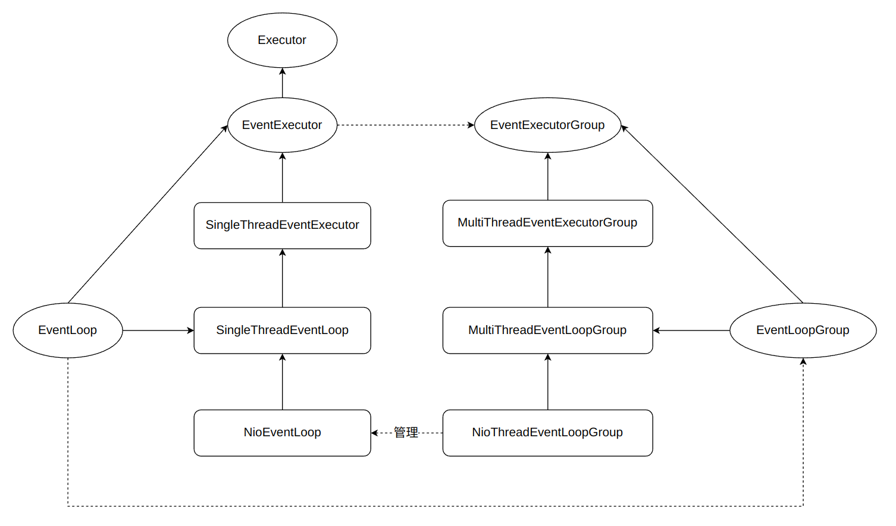

# EventLoop 类之间的关系

`EventExecutor`作为事件执行器，负责时间的真正执行，因此也继承了`Executor`接口，可以看作一个线程。
所以，对应的`EventExecutorGroup`则可以看作一个线程池了。

`EventLoop`作为事件循环，需要依赖事件执行器的能力，因此`EventExecutor`有的能力他都有，需要对其进行继承。

`Group`负责对资源进行管理，因此资源有的能力`Group`都要有，所以具体的能力在`Groop`中定义，资源继承`Group`。其实这里我觉得`Group`继承资源更好，但是为了贴近源码，先这样子吧。